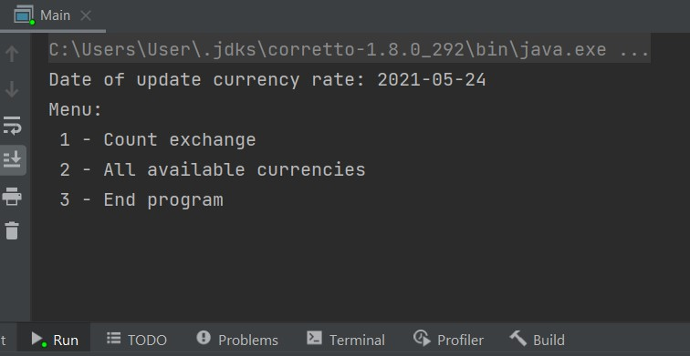
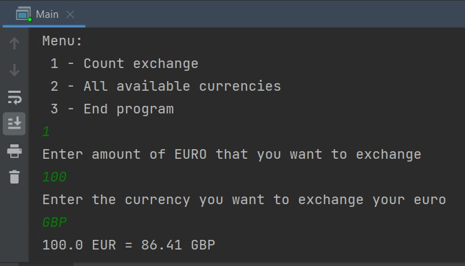
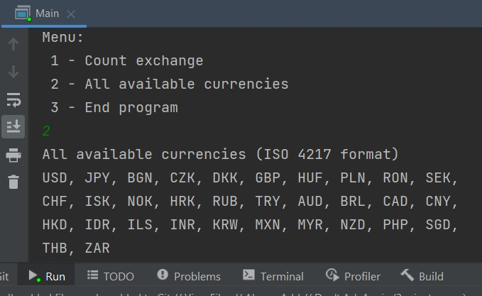

## Kalkulator Walut

### Zadanie - opis
Zadanie polega na napisaniu prostego kalkulatora walut w języku JAVA.
### Założenia:
- Program musi się uruchamiać na jdk 1.8 (wykorzystany "corretto-1.8.0_292")
- Czas na wykonanie zadania 48h.
### Wymagania:
- Zadanie polega na napisaniu prostego kalkulatora walut w języku JAVA.
- Źródłem kursów walut jest plik zgodny z http://www.ecb.europa.eu/stats/eurofxref/eurofxref-daily.xml, plik ma być czytany z dysku w bieżącym katalogu projektu.
- Należy napisać parser pliku z kursami walut (dopuszczalne jest użycie bibliotek do parsowania XMLa) i klasę kalkulatora.
- Kalkulator powinien przyjmować kwotę w EUR i docelową walutę, zwracać kwotę w docelowej walucie.

### Wykonane przez:
Dominik Soczyński

## Wynik uruchomienia programu
### Widok menu

### Widok wymiany waluty

### Widok wypisania dostępnych walut

